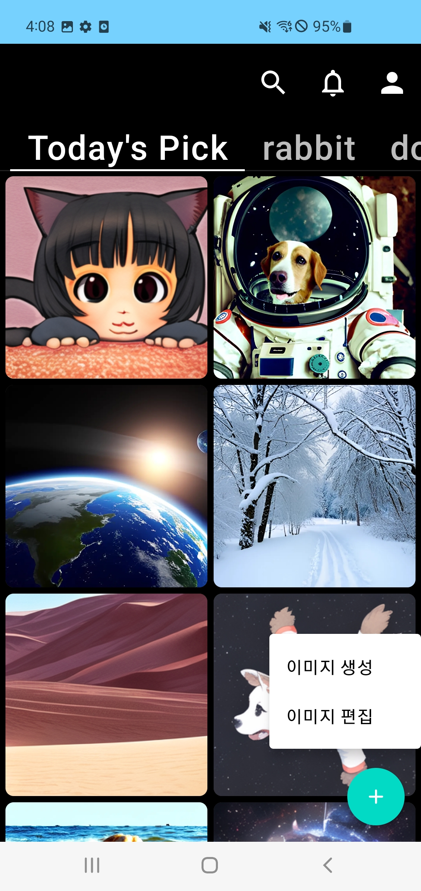

# Site

- https://home.hexa-backenders.com/

## Production

- https://defiant-headphones-545.notion.site/5e677b6e22004ab29a50c8c9cf0c3f0b

## Architecture

> ##### Kubernetes Cluster

 

> ##### Jenkins Pipeline

 

> ##### Architecture Flow

# Funtion and UI

## Home
### Today's Pick

### Monthly

### FloatingButton

## Detail
### 

## Notification
### push message

### in app message

## Search
### 

## ProfilePage
### myworks

### likes

## Text2Image
### selection

### generation activity

### text input

### example result

## Edit
### selection

### base edit

### face swap
- 1. source
    

- 2. target
    

- 3. result
    

### AI Reinforcements
- one function of them (Deblur)
- 1. before
    

- 2. after 
    

### Change Style
- 1. before
    

- 2. after
    

### Super Resolution
- 1. before
    
    

- 2. after
    
    

### Loading Screen

